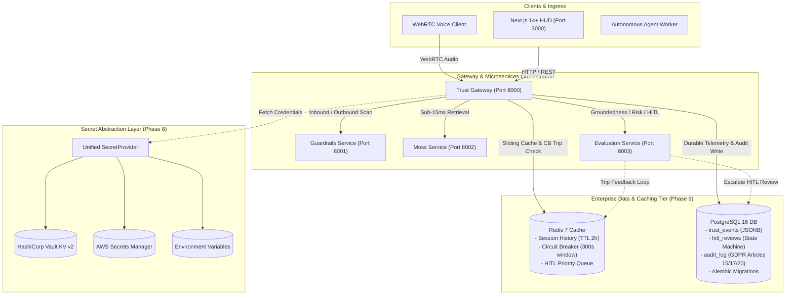

# TrustMoss

> **Real-Time Trust, Security & Reliability Gateway for AI Agents**  
> *YC Fall 2026 x Moss: Zero Latency Builder Sprint — Track: Agent Reliability, Security & Evaluation*

[](https://github.com/bhola-dev58/TrustMoss/actions/workflows/ci.yml)
[](https://github.com/bhola-dev58/TrustMoss/actions/workflows/docker-integration.yml)
[](apps/api)
[](apps/web)
[](docs/DATABASE_PERSISTENCE.md)
[](docs/DATABASE_PERSISTENCE.md)
[](docs/SECRETS_MANAGEMENT.md)
[-brightgreen)](apps/api/tests)
[](LICENSE)

---

## Overview

**TrustMoss** is an enterprise runtime trust and guardrail gateway that sits between an AI agent's retrieval step and response generation. Leveraging **Moss** as the low-latency contextual retrieval layer, TrustMoss evaluates every interaction in real-time, executing pre-generation and post-generation safety checks to issue a live **Trust Score**, prevent hallucinations, and trip automated circuit breakers before ungrounded outputs reach users.

---

## 🏛️ System Architecture & 23-Node Topology

TrustMoss is structured across 6 decoupled microservice layers, enterprise persistence, and secret injection backends:



### Production Microservices Registry

| Service | Container Name | Port | Purpose |
| :--- | :--- | :---: | :--- |
| **Trust Gateway** | `trustmoss-gateway` | `8000` | Ingress orchestrator, JWT & RBAC auth, tracer, circuit breaker gate |
| **Inbound/Outbound Guardrails** | `trustmoss-guardrails` | `8001` | Prompt injection defense, jailbreak analysis, Presidio PII redaction |
| **Moss Retrieval Service** | `trustmoss-moss-service` | `8002` | Sub-15ms hybrid vector context retrieval |
| **Evaluation & Governance** | `trustmoss-evaluation` | `8003` | Groundedness scoring, hallucination risk tiers, encrypted HITL queue |
| **Autonomous Voice Agent** | `trustmoss-voice-agent` | — | LiveKit WebRTC audio worker with real-time utterance circuit breaker |
| **Reliability HUD (UI)** | `trustmoss-web` | `3000` | Next.js 14+ App Router SSR dashboard with real-time trust telemetry |
| **PostgreSQL 16** | `trustmoss-postgres` | `5432` | Primary relational store for telemetry, review state machine, and audit logs |
| **Redis 7** | `trustmoss-redis` | `6379` | Distributed session cache (TTL 2h), rolling circuit breaker, HITL queue |
| **HashiCorp Vault** | `trustmoss-vault` | `8200` | Enterprise secret management with KV v2 engine in dev/prod modes |

---

## 📚 Technical Documentation & Traceability

| Document | Link | Description |
| :--- | :--- | :--- |
| **23-Node Architecture Spec** | [`docs/ARCHITECTURE.md`](docs/ARCHITECTURE.md) | Complete topology, sequence diagrams, and technology stack breakdown |
| **Database & Caching Layer** | [`docs/DATABASE_PERSISTENCE.md`](docs/DATABASE_PERSISTENCE.md) | PostgreSQL schema, JSONB indexing, Alembic migrations, Redis key schema |
| **Enterprise Secrets Management** | [`docs/SECRETS_MANAGEMENT.md`](docs/SECRETS_MANAGEMENT.md) | Vault, AWS Secrets Manager, and ENV provider setup with zero-downtime rotation |
| **Requirements Traceability Matrix** | [`docs/REQUIREMENTS_TRACEABILITY_MATRIX.md`](docs/REQUIREMENTS_TRACEABILITY_MATRIX.md) | 1:1 mapping of all 23 nodes to functional requirements and acceptance criteria |
| **Product Requirements Document (PRD)**| [`docs/PRD.md`](docs/PRD.md) | Product vision, functional specs, user personas, and measurable criteria |
| **CRISPE Prompt Catalog** | [`docs/PROMPT_CATALOG.md`](docs/PROMPT_CATALOG.md) | Full specification of all 7 production CRISPE prompt templates |
| **Developer Manual Run Guide** | [`MANUAL_RUN.md`](MANUAL_RUN.md) | Step-by-step developer manual for local testing, linting, and smoke tests |

---

## 🚀 Quickstart

### Option 1 — Docker Compose (Recommended)

Start all 9 decoupled microservices, database, cache, and secrets provider in a single command:

```bash
# 1. Clone the repository
git clone https://github.com/bhola-dev58/TrustMoss.git
cd TrustMoss

# 2. Configure environment variables
cp apps/api/.env.example apps/api/.env

# 3. Start all services
docker compose up -d

# 4. Apply database migrations
alembic upgrade head

# 5. Access the services
# - Dashboard & Reliability HUD -> http://localhost:3000
# - API Gateway Swagger Docs     -> http://localhost:8000/docs
# - Gateway Health & Telemetry  -> http://localhost:8000/health
# - HashiCorp Vault UI          -> http://localhost:8200
```

### Option 2 — Local Development (Python Virtual Environment)

```bash
# 1. Create and activate virtual environment
python3 -m venv .venv
source .venv/bin/activate

# 2. Install dependencies
pip install -r apps/api/requirements.txt

# 3. Run unit tests
pytest apps/api/tests/ -v --tb=short

# 4. Run linting and security scanning
ruff check apps/api/ services/
bandit -r apps/api/ services/ -ll
```

---

## 🔒 Security, Privacy & Compliance

- **Authentication & RBAC:** Cryptographic JWT tokens (HS256/RS256) enforcing role separation (`agent`, `reviewer`, `admin`).
- **Data-at-Rest Protection:** AES-256-GCM AEAD encryption with 96-bit unique nonces and Additional Authenticated Data (AAD) context binding.
- **OWASP Defense-in-Depth:** Mandatory security headers (`CSP`, `HSTS`, `X-Frame-Options: DENY`, `X-Content-Type-Options: nosniff`) injected on 100% of responses.
- **GDPR Compliance:** Native support for Article 15 (Access), Article 17 (Right to Erasure), Article 20 (Portability), and automated TTL purge routines.

---

## 🤝 Contributing

1. Fork the repository
2. Create your feature branch: `git checkout -b feat/your-feature-name`
3. Verify test suite passes: `pytest apps/api/tests/`
4. Commit your changes following conventional commits: `git commit -m "feat: add your feature"`
5. Push to the branch and submit a Pull Request

---

## 📄 License

This project is licensed under the MIT License — see the [LICENSE](LICENSE) file for details.
