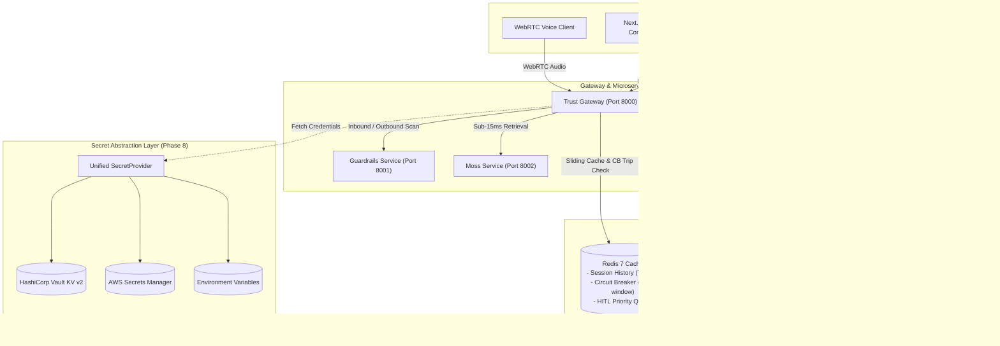
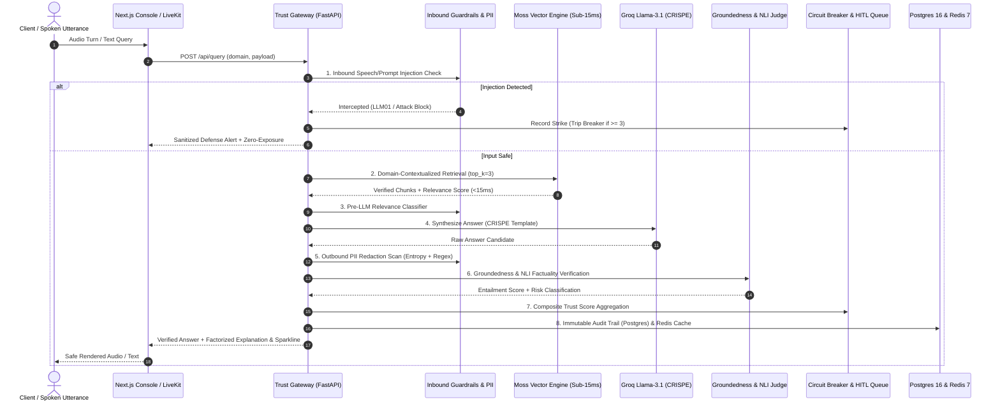

# TrustMoss

> **Real-Time Trust, Security & Reliability Gateway for AI Agents**  
> *YC Fall 2026 x Moss: Zero Latency Builder Sprint — Track: Agent Reliability, Security & Evaluation*

[](https://github.com/bhola-dev58/TrustMoss/actions/workflows/ci.yml)
[](https://github.com/bhola-dev58/TrustMoss/actions/workflows/docker-integration.yml)
[](apps/api)
[](apps/web)
[](docs/DATABASE_PERSISTENCE.md)
[](docs/DATABASE_PERSISTENCE.md)
[](docs/SECRETS_MANAGEMENT.md)
[-brightgreen)](apps/api/tests)
[](LICENSE)

---

## Overview

**TrustMoss** is an enterprise runtime trust and guardrail gateway that sits between an AI agent's retrieval step and response generation. Leveraging **Moss** as the low-latency contextual retrieval layer, TrustMoss evaluates every interaction in real-time, executing pre-generation and post-generation safety checks to issue a live **Trust Score**, prevent hallucinations, trip automated circuit breakers before ungrounded outputs reach users, and enforce continuous sub-45ms P95 performance SLA gating via integrated open-source k6 scalability engines.

---

## System Architecture & 24-Node Topology

TrustMoss is structured across 7 decoupled microservice layers, enterprise persistence, and secret injection backends:



### Production Microservices Registry

| Service | Container Name | Port | Purpose |
| :--- | :--- | :---: | :--- |
| **Trust Gateway** | `trustmoss-gateway` | `8000` | Ingress orchestrator, JWT & RBAC auth, tracer, circuit breaker gate |
| **Inbound/Outbound Guardrails** | `trustmoss-guardrails` | `8001` | Prompt injection defense, jailbreak analysis, Presidio PII redaction |
| **Moss Retrieval Service** | `trustmoss-moss-service` | `8002` | Sub-15ms hybrid vector context retrieval |
| **Evaluation & Governance** | `trustmoss-evaluation` | `8003` | Groundedness scoring, hallucination risk tiers, encrypted HITL queue |
| **Autonomous Voice Agent** | `trustmoss-voice-agent` | — | LiveKit WebRTC audio worker with real-time utterance circuit breaker |
| **Operations Console & HUD** | `trustmoss-web` | `3000` | Next.js 14+ App Router SSR dashboard with real-time trust telemetry & k6 UI |
| **PostgreSQL 16** | `trustmoss-postgres` | `5432` | Primary relational store for telemetry, review state machine, and load test runs |
| **Redis 7** | `trustmoss-redis` | `6379` | Distributed session cache (TTL 2h), rolling circuit breaker, HITL queue |
| **HashiCorp Vault** | `trustmoss-vault` | `8200` | Enterprise secret management with KV v2 engine in dev/prod modes |
| **k6 Scalability Engine** | `trustmoss-k6` | — | Local open-source load & stress testing engine with sub-45ms SLA gating |

---

## k6 OSS Scalability Testing Engine & Sub-45ms SLA Gate

TrustMoss includes a native, open-source performance testing harness directly integrated into the Gateway and Operations Console:
* **Zero External Dependencies:** Auto-detects local `k6` executable (`K6_PATH` or `PATH`) and falls back cleanly to realistic asynchronous simulation.
* **5 Standardized Load Profiles:** `load` (steady baseline), `ramp` (progressive step-up), `stress` (breaking point identification), `spike` (abrupt burst), and `soak` (endurance/leak detection).
* **Strict Automated SLA Gating:** Every script embeds assertions `p(95) < 45ms`, `p(99) < 75ms`, and `http_req_failed < 0.01`, failing CI workflows if violated.
* **Non-Blocking Process Management:** Background execution with PID tracking, graceful `SIGTERM` cancellation via `POST /api/load-tests/{id}/cancel`, and PostgreSQL 16 `load_test_runs` telemetry persistence.

```bash
# Execute local k6 scalability unit tests
./apps/api/.venv/bin/python -m pytest apps/api/tests/test_load_test.py -v
```

---

## Full Bidirectional Requirements Traceability Matrix (RTM)

| Node | Architecture Node Name | Domain | Requirement ID | Measurable Acceptance Criteria (MAC) | Implementation File | Verification Test Suite | Status |
| :---: | :--- | :--- | :--- | :--- | :--- | :--- | :---: |
| **1** | Inbound Guardrails Scanner | Security | `FR-SEC-01` | `MAC-SEC-01.1–01.3` | `services/guardrails_service.py` | `test_evaluation_prompts.py` | VERIFIED |
| **2** | Outbound Guardrails Scanner | Security | `FR-SEC-02` | `MAC-SEC-02.1–02.3` | `services/guardrails_service.py` | `test_microservices.py` | VERIFIED |
| **3** | JWT & RBAC Auth Engine | Security | `FR-SEC-03` | `MAC-SEC-03.1–03.3` | `apps/api/auth.py` | `test_auth_security.py` | VERIFIED |
| **4** | OWASP Security Headers | Security | `FR-SEC-04` | `MAC-SEC-04.1–04.3` | `apps/api/main.py` | `test_auth_security.py` | VERIFIED |
| **5** | Cryptographic AEAD Core | Security | `FR-SEC-05` | `MAC-SEC-05.1–05.3` | `apps/api/crypto.py` | `test_crypto_encryption.py` | VERIFIED |
| **6** | GDPR Retention & Erasure | Security | `FR-SEC-06` | `MAC-SEC-06.1–06.3` | `apps/api/retention.py` | `test_retention_gdpr.py` | VERIFIED |
| **7** | Trust Gateway Orchestrator | Real-Time | `FR-RT-01` | `MAC-RT-01.1–01.3` | `apps/api/main.py` | `test_microservices.py` | VERIFIED |
| **8** | Pre-Gen Relevance Gate | Real-Time | `FR-RT-02` | `MAC-RT-02.1–02.3` | `services/moss_service.py` | `test_microservices.py` | VERIFIED |
| **9** | Groundedness Evaluator | Real-Time | `FR-RT-03` | `MAC-RT-03.1–03.3` | `services/evaluation_service.py` | `test_evaluation_prompts.py` | VERIFIED |
| **10** | Hallucination Risk Classifier | Real-Time | `FR-RT-04` | `MAC-RT-04.1–04.3` | `services/evaluation_service.py` | `test_evaluation_prompts.py` | VERIFIED |
| **11** | Trust Score Aggregator | Real-Time | `FR-RT-05` | `MAC-RT-05.1–05.3` | `apps/api/main.py` | `test_explainability.py` | VERIFIED |
| **12** | Dynamic Circuit Breaker | Real-Time | `FR-RT-06` | `MAC-RT-06.1–06.3` | `apps/api/main.py` | `test_microservices.py` | VERIFIED |
| **13** | OTel Latency Tracer | Real-Time | `FR-RT-07` | `MAC-RT-07.1–07.3` | `apps/api/voice_gateway.py` | `test_livekit_gateway.py` | VERIFIED |
| **14** | Explainability Engine | Real-Time | `FR-RT-08` | `MAC-RT-08.1–08.3` | `apps/api/explainability.py` | `test_explainability.py` | VERIFIED |
| **15** | LiveKit Token Service | Voice | `FR-VOICE-01` | `MAC-VOICE-01.1–01.3` | `apps/api/livekit_service.py` | `test_livekit_gateway.py` | VERIFIED |
| **16** | Voice Interceptor & Breaker | Voice | `FR-VOICE-02` | `MAC-VOICE-02.1–02.3` | `apps/api/voice_gateway.py` | `test_livekit_gateway.py` | VERIFIED |
| **17** | Autonomous Voice Worker | Voice | `FR-VOICE-03` | `MAC-VOICE-03.1–03.3` | `apps/api/livekit_agent_worker.py` | `test_crispe_prompts.py` | VERIFIED |
| **18** | Moss Retrieval Engine Core | Moss Core | `FR-MOSS-01` | `MAC-MOSS-01.1–01.3` | `services/moss_service.py` | `test_microservices.py` | VERIFIED |
| **19** | Knowledge Ingestion Pipeline | Moss Core | `FR-MOSS-02` | `MAC-MOSS-02.1–02.3` | `services/moss_service.py` | `test_microservices.py` | VERIFIED |
| **20** | Index Version Registry | Moss Core | `FR-MOSS-03` | `MAC-MOSS-03.1–03.3` | `services/moss_service.py` | `test_microservices.py` | VERIFIED |
| **21** | HITL Review Queue & Alerts | Governance | `FR-GOV-01` | `MAC-GOV-01.1–01.3` | `services/evaluation_service.py` | `test_crypto_encryption.py` | VERIFIED |
| **22** | CRISPE Prompt Catalog | Governance | `FR-GOV-02` | `MAC-GOV-02.1–02.3` | `apps/api/prompts/catalog.py` | `test_prompt_catalog.py` | VERIFIED |
| **23** | Next.js Reliability HUD & UI | User Interface | `FR-UI-01` | `MAC-UI-01.1–01.4` | `apps/web/app/page.jsx` | `components.test.jsx` (10 tests) | VERIFIED |
| **24** | k6 Scalability Engine & SLA Gate | Performance | `FR-PERF-01–04` | `MAC-PERF-01.1–02.3` | `apps/api/load_test.py` | `test_load_test.py` (11 tests) | VERIFIED |

---

## Technical Documentation & Traceability

| Document | Link | Description |
| :--- | :--- | :--- |
| **24-Node Architecture Spec** | [`docs/ARCHITECTURE.md`](docs/ARCHITECTURE.md) | Complete topology, sequence diagrams, and technology stack breakdown |
| **Database & Caching Layer** | [`docs/DATABASE_PERSISTENCE.md`](docs/DATABASE_PERSISTENCE.md) | PostgreSQL schema, JSONB indexing, Alembic migrations, Redis key schema |
| **Enterprise Secrets Management** | [`docs/SECRETS_MANAGEMENT.md`](docs/SECRETS_MANAGEMENT.md) | Vault, AWS Secrets Manager, and ENV provider setup with zero-downtime rotation |
| **Requirements Traceability Matrix** | [`docs/REQUIREMENTS_TRACEABILITY_MATRIX.md`](docs/REQUIREMENTS_TRACEABILITY_MATRIX.md) | 1:1 mapping of all 24 nodes to functional requirements and acceptance criteria |
| **Product Requirements Document (PRD)**| [`docs/PRD.md`](docs/PRD.md) | Product vision, functional specs, user personas, and measurable criteria |
| **CRISPE Prompt Catalog** | [`docs/PROMPT_CATALOG.md`](docs/PROMPT_CATALOG.md) | Full specification of all 7 production CRISPE prompt templates |
| **Developer Manual Run Guide** | [`MANUAL_RUN.md`](MANUAL_RUN.md) | Step-by-step developer manual for local testing, linting, and smoke tests |

---

## Quickstart

### Option 1 — Docker Compose (Recommended)

Start all decoupled microservices, database, cache, and secrets provider in a single command:

```bash
# 1. Clone the repository
git clone https://github.com/bhola-dev58/TrustMoss.git
cd TrustMoss

# 2. Configure environment variables
cp apps/api/.env.example apps/api/.env

# 3. Start all services
docker compose up -d

# 4. Apply database migrations
alembic upgrade head

# 5. Access the services
# - Dashboard & Reliability HUD -> http://localhost:3000
# - API Gateway Swagger Docs     -> http://localhost:8000/docs
# - Gateway Health & Telemetry  -> http://localhost:8000/health
# - HashiCorp Vault UI          -> http://localhost:8200
```

### Option 2 — Local Development (Python Virtual Environment & Node)

```bash
# 1. Backend setup
python3 -m venv .venv
source .venv/bin/activate
pip install -r apps/api/requirements.txt
pip install -r apps/api/requirements-dev.txt

# 2. Run backend test suite (247 tests passing)
pytest apps/api/tests/ -v --tb=short

# 3. Frontend setup & component tests (10 tests passing)
cd apps/web && npm ci && npm test

# 4. Run linting and security scanning
ruff check apps/api/ services/
bandit -r apps/api/ services/ -ll
```

---

## 8-Hop Runtime Guardrail & Zero-Trust Retrieval Flow

Every conversational turn or text query executes across a zero-trust multi-hop verification pipeline before any generation reaches the end user:



---

## PRD Traceability & Sprint Criteria Matrix

| Hackathon Requirement | TrustMoss Architectural Implementation | Traceability & Source |
| :--- | :--- | :--- |
| **Fast Retrieval** | Sub-15ms vector retrieval with domain-contextualized query prefixing (`security`, `finance`, `healthcare`, `general`) | `apps/api/moss_client.py`<br/>`apps/web/components/hud/ContextViewer.jsx` |
| **Continuous Context Evaluation** | Two-tier NLI entailment scoring and tri-state hallucination risk categorization (`LOW`, `MEDIUM`, `HIGH`, `CRITICAL`) | `services/evaluation/evaluator.py`<br/>`prompts/crispe.py::GROUNDEDNESS_JUDGE_V1` |
| **Latency Tracing** | Microsecond-accurate pipeline stage tracing with interactive visual waterfall HUD in Next.js 14 App Router | `apps/api/tracer.py`<br/>`apps/web/components/hud/LatencyWaterfall.jsx` |
| **Real-Time Agent Guardrails** | Inbound speech injection filter, Presidio & regex PII masking, pre-LLM relevance verification, and automated circuit breaker | `apps/api/voice_gateway.py`<br/>`apps/api/guardrails/` |
| **Adversarial Stress Testing** | Interactive Attack Lab testing 8 attack vectors against OWASP Top 10 for LLM with 1-click batch simulation | `apps/api/main.py::/api/attack/simulate`<br/>`apps/web/components/attack/AttackSimulator.jsx` |
| **Multi-Provider LLM Inference** | Primary HiDevs Gemini 3.5/3.6 Flash engine (100K token grant) with automatic Groq Llama-3.1-8B and deterministic fallback | `apps/api/llm_provider.py`<br/>`apps/api/main.py::call_llm`<br/>`apps/api/voice_gateway.py` |
| **Auditability & Compliance** | Certified JSON audit export covering GDPR (Articles 15/17/25), NIST AI RMF 1.0, and EU AI Act Article 13 | `apps/api/main.py::/api/compliance/audit-report`<br/>`apps/web/components/audit/ComplianceExportButton.jsx` |

---

## Security, Privacy & Compliance

- **Authentication & RBAC:** Cryptographic JWT tokens (HS256/RS256) enforcing role separation (`agent`, `reviewer`, `admin`).
- **Data-at-Rest Protection:** AES-256-GCM AEAD encryption with 96-bit unique nonces and Additional Authenticated Data (AAD) context binding.
- **OWASP Defense-in-Depth:** Mandatory security headers (`CSP`, `HSTS`, `X-Frame-Options: DENY`, `X-Content-Type-Options: nosniff`) injected on 100% of responses.
- **GDPR Compliance:** Native support for Article 15 (Access), Article 17 (Right to Erasure), Article 20 (Portability), and automated TTL purge routines.

---

## Contributing

1. Fork the repository
2. Create your feature branch: `git checkout -b feat/your-feature-name`
3. Verify test suite passes: `pytest apps/api/tests/`
4. Commit your changes following conventional commits: `git commit -m "feat: add your feature"`
5. Push to the branch and submit a Pull Request

---

## License

This project is licensed under the MIT License — see the [LICENSE](LICENSE) file for details.
