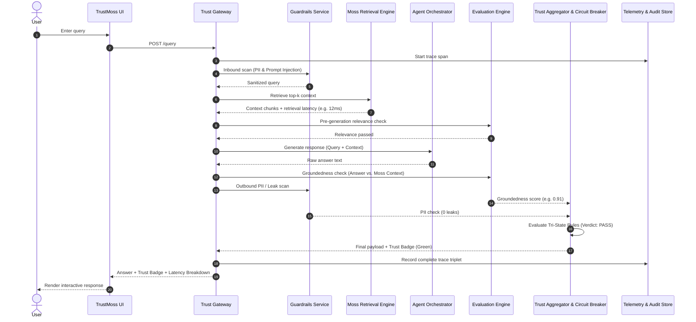
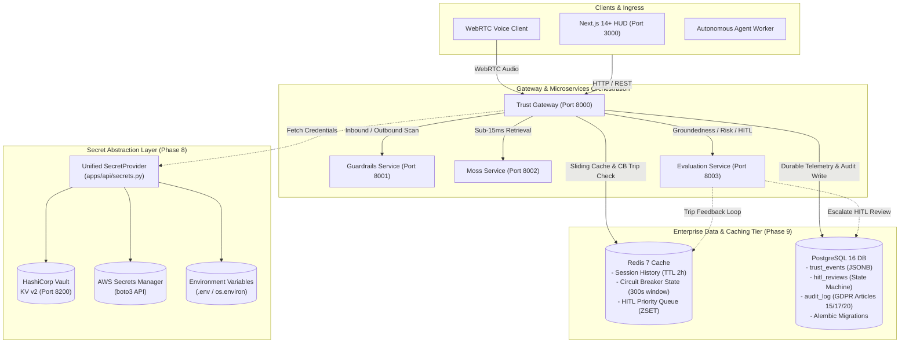
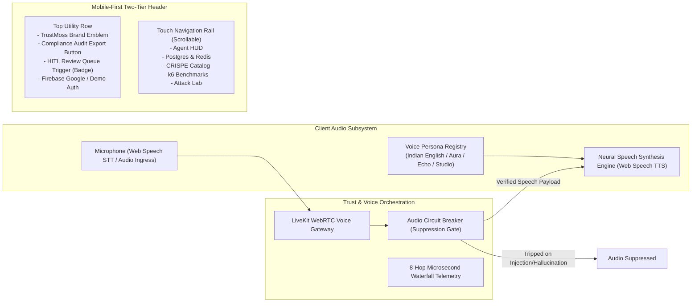

# TrustMoss — Enterprise Architecture Specification

> **Track:** Agent Reliability, Security & Evaluation  
> **Challenge:** YC Fall 2026 x Moss: Zero Latency Builder Sprint  
> **Repository:** [https://github.com/bhola-dev58/TrustMoss](https://github.com/bhola-dev58/TrustMoss)

---

## 1. System Overview & Executive Summary

**TrustMoss** is a real-time, closed-loop trust and reliability gateway designed to wrap LLM-powered agents in a verifiable safety fabric. Using **Moss** as the high-speed contextual retrieval engine, TrustMoss continuously evaluates queries, context relevance, answer groundedness, and data privacy before any response reaches an end user.

The architecture decouples the agent's reasoning from safety enforcement through two synchronized loops:
1. **The Real-Time Trust Pipeline (Sync Loop):** Sub-millisecond and low-latency interception performing inbound guardrails, Moss semantic retrieval, pre-generation relevance filtering, LLM reasoning, post-generation groundedness evaluation, and tri-state circuit breaking.
2. **The Knowledge Governance & HITL Pipeline (Async Loop):** Continuous telemetry streaming, automated drift alerting, human-in-the-loop (HITL) audit routing, and immutable knowledge base version control with atomic rollback capability.

---

## 2. High-Level Architecture Diagram

```
                              ┌───────────────────────────────────┐
                              │           TrustMoss UI            │
                              │    (Next.js / React Dashboard)    │
                              └─────────────────┬─────────────────┘
                                                │ HTTPS / WSS
                                                ▼
                              ┌───────────────────────────────────┐
                              │           Trust Gateway           │
                              │       (FastAPI / Rate Limiter)    │
                              └─────────────────┬─────────────────┘
                                                │
                 ┌──────────────────────────────┴──────────────────────────────┐
                 ▼                                                             ▼
     [INBOUND GUARDRAILS]                                             [OTel TELEMETRY]
   - Prompt Injection Filter                                       - Microsecond hop tracing
   - Inbound PII Redaction                                         - Triplet Audit Store
                 │                                                             │
                 ▼                                                             ▼
     ┌──────────────────────┐        Context Chunks                ┌──────────────────────┐
     │ Moss Retrieval Core  ├────────────────────────────┐         │   Continuous Eval    │
     │ (Hybrid / Vector DB) │                            │         │     & RAG Triad      │
     └──────────┬───────────┘                            │         └──────────────────────┘
                │                                        ▼
                │                          ┌───────────────────────────┐
                │                          │ Pre-Gen Relevance Gate    │
                │                          │ (Threshold Filter >= 0.7) │
                │                          └─────────────┬─────────────┘
                │                                        │ Clean Context
                │                                        ▼
                │                          ┌───────────────────────────┐
                │                          │    Agent Orchestrator     │
                │                          │   (Groq / Llama-3.1-8B)   │
                │                          └─────────────┬─────────────┘
                │                                        │ Generated Output
                │                                        ▼
                │                          ┌───────────────────────────┐
                │                          │ Post-Gen Groundedness &   │
                │                          │ Outbound PII Scanner      │
                │                          └─────────────┬─────────────┘
                │                                        │ Scores & Verdicts
                ▼                                        ▼
     ┌─────────────────────────────────────────────────────────────────┐
     │              Trust Score Aggregator & Circuit Breaker           │
     │      • PASS (Green): Relevance >= 0.7, Grounding >= 0.7, Safe   │
     │      • WARN (Yellow): Single border metric; served with warning │
     │      • FAIL (Red): Circuit tripped; return safe fallback        │
     └─────────────────┬───────────────────────────────┬───────────────┘
                       │ Flagged Failures              │ Clean Response
                       ▼                               ▼
     ┌──────────────────────────────────┐      ┌───────────────┐
     │     HITL Review Queue &          │      │ End User /    │
     │      Alerting Manager            │      │ Dashboard UI  │
     └─────────────────┬────────────────┘      └───────────────┘
                       │ Human Verified Corrections
                       ▼
     ┌──────────────────────────────────┐
     │   Knowledge Ingestion Pipeline   │
     │       (Celery / Async)           │
     └─────────────────┬────────────────┘
                       │ Staged Index Update
                       ▼
     ┌──────────────────────────────────┐
     │    Version Manager & Sanity Gate │  Pre-Deployment Gating:
     │   - Groundedness >= 0.85         │  - Atomic Blue/Green Switch
     │   - Zero Security Regressions    │  - One-Click Rollback
     │   - P95 Moss Latency < 50ms      │
     └─────────────────┬────────────────┘
                       ▼
     ┌──────────────────────────────────┐
     │   Index Version Registry         │
     │   (Semantic Commit Hashes)       ├──────► Re-indexes Moss Retrieval Core
     └──────────────────────────────────┘
```

---

## 3. Subsystem Breakdown

### 3.1. Edge & Client Layer
- **TrustMoss UI:** Single-page dashboard built with React and Tailwind CSS. Features live chat, live Trust Badge (Green/Yellow/Red), per-hop latency waterfall bars, citation sources, and a dedicated HITL Review tab.
- **Trust Gateway:** FastAPI backend providing authenticated routing, token bucket rate limiting, and distributed request context initialization.

### 3.2. Guardrails & Safety Perimeter
- **Inbound Security:** Intercepts prompts prior to retrieval to neutralize jailbreak vectors and redact sensitive personal identifiers (PII).
- **Pre-Generation Relevance Gate:** Evaluates the cosine similarity and semantic overlap of chunks returned by Moss. Chunks scoring below threshold ($\tau = 0.60$) are discarded to prevent prompt poisoning.
- **Post-Generation Safety:** Outbound regex and entity scanner ensuring zero credential leaks, API tokens, or PII in answers.

### 3.3. Knowledge Core: Moss Retrieval Engine
- Serves as the primary source of truth for the agent.
- Leverages Moss ultra-fast vector search and hybrid sparse-dense indexing to fetch top-$k$ contextual evidence under **50ms**.
- Emits explicit per-chunk relevance confidence scores and retrieval latency metrics.

### 3.4. Agent Orchestrator & Reasoning Core
- Powered by Groq-hosted `llama-3.1-8b-instant` for ultra-fast generation ($< 500\text{ ms}$).
- Strictly prompts the LLM to restrict synthesis to the validated Moss context chunks.

### 3.5. Reliability & Trust Evaluation Engine
- **Groundedness Evaluator:** Compares the final response text against retrieved Moss context chunks using token overlap and natural language inference (NLI) heuristics.
- **Tri-State Trust Aggregator:**
  - **PASS (Score: 1.0):** All guardrails pass. Response delivered with green trust badge.
  - **WARN (Score: 0.5):** Exactly 1 check indicates marginal context alignment. Response served with a prominent disclaimer badge.
  - **FAIL (Score: 0.0):** 2+ checks fail OR any PII is detected. Circuit breaker trips immediately: suppresses raw model output and delivers a secure fallback message ("Unable to ground response safely in knowledge base").

### 3.6. Operational Alerting & Observability
- **OpenTelemetry Tracer:** Instruments every pipeline hop:
  $$\Delta t_{\text{total}} = \Delta t_{\text{Moss}} + \Delta t_{\text{Guardrails}} + \Delta t_{\text{LLM}} + \Delta t_{\text{Eval}}$$
- **Audit Store:** Immutable PostgreSQL/ClickHouse log capturing `{query_id, prompt, moss_context, answer, trust_verdict, latency_breakdown}`.
- **Alerting Manager:** Triggers PagerDuty/Slack webhooks when the rolling 5-minute failure rate exceeds **5%** or average groundedness dips below **0.65**.

### 3.7. Knowledge Governance & Version Control ("Git for Moss")
- **HITL Review Queue:** Operations portal where flagged FAIL/WARN interactions are reviewed and corrected by domain experts.
- **Knowledge Ingestion Pipeline:** Asynchronous worker pipeline that ingests approved corrections.
- **Index Version Registry:** Records immutable snapshots of the Moss vector index, keyed by semantic commit hashes.
- **Version Manager & Sanity Eval Gate:** Enforces production gates before activating new index versions:
  1. Groundedness $\ge 0.85$ against golden benchmark queries.
  2. Zero regression on security benchmarks.
  3. P95 Moss retrieval latency $< 50\text{ ms}$.
- **Zero-Downtime Rollback:** Instant rollback to previous known-good index commit in the event of upstream data contamination.

---

## 4. Execution Data Flow (Single Query Lifecycle)



---

## 5. Technology Stack Summary

| Subsystem | Technology | Purpose |
|---|---|---|
| Retrieval Engine | **Moss API / SDK** | Sub-15ms hybrid & vector context retrieval |
| Agent LLM | **Groq (Llama-3.1-8B-Instant)** | High-throughput low-latency inference |
| Voice Gateway | **LiveKit (WebRTC / livekit-agents)** | Real-time audio streaming, live transcript guardrails & audio circuit breaker |
| Backend API | **FastAPI (Python 3.12)** | Async REST gateway & pipeline orchestrator |
| Frontend | **Next.js 14+ (App Router)** | SSR dashboard with secure API route proxies & LiveKit voice room HUD |
| Tracing & Telemetry | **OpenTelemetry** | Granular 8-hop latency tracing |
| Data Governance | **Index Version Registry** | Semantic commit snapshots & atomic rollback |
| Task Queue | **Celery / Redis** | Asynchronous HITL knowledge ingestion |

---

## 6. Requirements Traceability & Verification Gating

Every component across the TrustMoss 23-Node Architecture is mapped 1:1 to formal Functional Requirement IDs (`FR-*`) and Measurable Acceptance Criteria (`MAC-*`) verified by 121 automated unit and integration tests.

The full matrix is maintained in [docs/REQUIREMENTS_TRACEABILITY_MATRIX.md](file:///home/bhola-dev58/Ozeonix/TrustMoss/docs/REQUIREMENTS_TRACEABILITY_MATRIX.md).

| Domain | Architecture Nodes | Requirement Prefix | Verification Test Suites | Status |
| :--- | :--- | :--- | :--- | :---: |
| **Enterprise Security & Cryptography** | Nodes 1–6 (Inbound/Outbound Guardrails, JWT/RBAC, OWASP, AES-256-GCM AEAD, GDPR) | `FR-SEC-01` – `06` | `test_auth_security.py`, `test_crypto_encryption.py`, `test_retention_gdpr.py` | ✅ VERIFIED |
| **Real-Time Reliability & Evaluation** | Nodes 7–14 (Gateway, Relevance Gate, Groundedness, Risk Classifier, Trust Aggregator, Circuit Breaker, OTel, Explainability) | `FR-RT-01` – `08` | `test_microservices.py`, `test_evaluation_prompts.py`, `test_explainability.py` | ✅ VERIFIED |
| **LiveKit WebRTC Voice Gateway** | Nodes 15–17 (Token Service, Audio Interceptor/Breaker, Autonomous Voice Worker) | `FR-VOICE-01` – `03` | `test_livekit_gateway.py`, `test_crispe_prompts.py` | ✅ VERIFIED |
| **Moss Retrieval & Knowledge Lifecycle** | Nodes 18–20 (Moss Retrieval Engine, Ingestion Pipeline, Index Version Registry) | `FR-MOSS-01` – `03` | `test_microservices.py`, `services/moss_service.py` | ✅ VERIFIED |
| **Governance, HITL & Prompt Catalog** | Nodes 21–22 (HITL Review Queue, CRISPE Prompt Catalog) | `FR-GOV-01` – `02` | `test_prompt_catalog.py`, `test_evaluation_prompts.py` | ✅ VERIFIED |
| **User Interface & Reliability HUD** | Node 23 (Next.js 14+ SSR Reliability HUD & Operations Console) | `FR-UI-01` | Next.js SSR Suite, WebRTC Audio HUD Component | ✅ VERIFIED |

---

## 7. Persistence, Caching & Secrets Topology (Phases 8 & 9)



### 7.1 Architecture Roles & Invariants

1. **HashiCorp Vault & AWS Secrets Manager (Phase 8)**
   - All critical secrets (`GROQ_API_KEY`, `ENCRYPTION_KEY`, `LIVEKIT_API_KEY`, `POSTGRES_DSN`, `REDIS_URL`) are loaded dynamically through `apps/api/secrets.py`.
   - In-process caching avoids N+1 secret fetches; `invalidate_cache()` enables zero-downtime key rotation.
   - Dev-mode HashiCorp Vault is bundled in `docker-compose.yml` with auto-seeding via `scripts/vault-init.sh`.

2. **Redis 7 Session Cache & Circuit Breaker (Phase 9)**
   - `session:{session_id}:history`: Sliding 2-hour TTL cache capped at 50 turns.
   - `circuit_breaker:{agent_id}`: Rolling 300-second window tracking consecutive trust failures. Reaching threshold = 3 immediately trips the circuit, fast-failing outbound agent queries with HTTP 503.
   - `hitl_queue:pending`: Sorted set ordering human-in-the-loop review escalations by urgency score.

3. **PostgreSQL 16 Relational Persistence (Phase 9)**
   - Managed via Alembic (`alembic upgrade head`) with immutable UUID keys and UTC timestamps.
   - Stores full telemetry in `trust_events`, reviewer decision lifecycle in `hitl_reviews`, and tamper-evident compliance audit records in `audit_log`.
   - Unhindered offline development: every data operation features zero-crash fallback to in-memory stores if databases are offline.

---

## 8. Frontend Design System & Neural Voice Audio Architecture (Phase 10)



### 8.1 Developer Ember / Dark Obsidian Design System
The user interface adheres to the **Developer Ember** aesthetic engineered for prolonged operations room monitoring:
- **Canvas Base (`--bg-main`):** `#121212` (Obsidian Black) — reduces visual fatigue in low-light developer environments.
- **Surfaces & Cards (`--bg-surface`):** `#1E1E1E` & `#242424` (Charcoal Surface) — tactile interactive containers.
- **Typography:** `#FFFFFF` (Primary Headers & High-Contrast Data) and `#9AA0A6` (Secondary Subtitles & Latency Traces).
- **Brand & Action Accent (`--accent-gradient`):** Sunset Amber Gradient (`#FF8C00` $\to$ `#FFC107`) with glowing specular borders.
- **Dividers (`--border-subtle`):** `#333333` — low-contrast structural dividers.

### 8.2 Two-Tier Mobile-First Header Architecture
- **Tier 1 (Utility & Brand Bar):** Displays brand shield with glowing amber gradient, status badge, compact Compliance Audit export trigger, real-time Human-in-the-Loop review counter badge, and Firebase authenticated user avatar with one-click sign-out.
- **Tier 2 (Swipeable Touch Rail):** Full-width horizontally scrollable navigation rail (`overflow-x-auto no-scrollbar`) offering $\ge 36\text{px}$ touch targets for all five core views without layout compression on mobile viewports.

### 8.3 Multi-Persona Neural Speech Synthesis Engine
To eliminate synthetic, mechanical robotic voices, `LiveKitVoiceRoom` implements an intelligent client-side voice selection and audio calibration engine:
1. **Dynamic Neural Voice Resolution (`resolveVoice`):**
   - Discovers installed high-fidelity browser neural voices (`Google US/UK/India`, `Microsoft Natural Online`, `Apple Enhanced Siri/Samantha/Rishi`) via `window.speechSynthesis.getVoices()`.
   - Filters and binds to real human voices based on the active persona.
2. **Native Personas:**
   - **Priya / Aarav (Indian English - `en-IN`, Default):** Syllable-timed cadence with warm conversational resonance (`rate: 0.98, pitch: 1.02`), binding to `en-IN` / `hi-IN` voices (Google Indian English, Microsoft Neerja/Ravi, Apple Rishi/Veena).
   - **Aura (Natural US Female):** Expressive feminine assistant cadence (`rate: 0.98, pitch: 1.04`).
   - **Echo (Natural US Male):** Deep, steady masculine cadence (`rate: 0.96, pitch: 0.94`).
   - **Studio (British English):** Formal UK English delivery (`en-GB`).
3. **Audio Engine Unlocking & Browser Resilience:**
   - Automatically unlocks browser audio context on user interaction to bypass mobile Safari and Chromium autoplay restrictions.
   - Cleans input text of markdown tokens, brackets, and URLs before synthesis.
   - Integrates interactive "Preview Real Voice" and per-turn "Play Voice" controls for immediate verification.

---

*TrustMoss — Built for the YC Fall 2026 x Moss Zero Latency Builder Sprint.*
