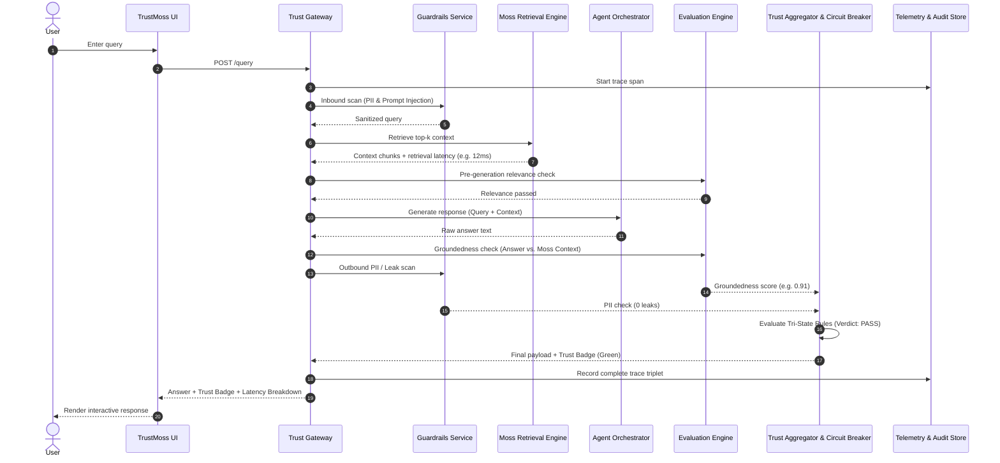

# TrustMoss — Enterprise Architecture Specification

> **Track:** Agent Reliability, Security & Evaluation  
> **Challenge:** YC Fall 2026 x Moss: Zero Latency Builder Sprint  
> **Repository:** [https://github.com/bhola-dev58/TrustMoss](https://github.com/bhola-dev58/TrustMoss)

---

## 1. System Overview & Executive Summary

**TrustMoss** is a real-time, closed-loop trust and reliability gateway designed to wrap LLM-powered agents in a verifiable safety fabric. Using **Moss** as the high-speed contextual retrieval engine, TrustMoss continuously evaluates queries, context relevance, answer groundedness, and data privacy before any response reaches an end user.

The architecture decouples the agent's reasoning from safety enforcement through two synchronized loops:
1. **The Real-Time Trust Pipeline (Sync Loop):** Sub-millisecond and low-latency interception performing inbound guardrails, Moss semantic retrieval, pre-generation relevance filtering, LLM reasoning, post-generation groundedness evaluation, and tri-state circuit breaking.
2. **The Knowledge Governance & HITL Pipeline (Async Loop):** Continuous telemetry streaming, automated drift alerting, human-in-the-loop (HITL) audit routing, and immutable knowledge base version control with atomic rollback capability.

---

## 2. High-Level Architecture Diagram

```
                              ┌───────────────────────────────────┐
                              │           TrustMoss UI            │
                              │    (Next.js / React Dashboard)    │
                              └─────────────────┬─────────────────┘
                                                │ HTTPS / WSS
                                                ▼
                              ┌───────────────────────────────────┐
                              │           Trust Gateway           │
                              │       (FastAPI / Rate Limiter)    │
                              └─────────────────┬─────────────────┘
                                                │
                 ┌──────────────────────────────┴──────────────────────────────┐
                 ▼                                                             ▼
     [INBOUND GUARDRAILS]                                             [OTel TELEMETRY]
   - Prompt Injection Filter                                       - Microsecond hop tracing
   - Inbound PII Redaction                                         - Triplet Audit Store
                 │                                                             │
                 ▼                                                             ▼
     ┌──────────────────────┐        Context Chunks                ┌──────────────────────┐
     │ Moss Retrieval Core  ├────────────────────────────┐         │   Continuous Eval    │
     │ (Hybrid / Vector DB) │                            │         │     & RAG Triad      │
     └──────────┬───────────┘                            │         └──────────────────────┘
                │                                        ▼
                │                          ┌───────────────────────────┐
                │                          │ Pre-Gen Relevance Gate    │
                │                          │ (Threshold Filter >= 0.7) │
                │                          └─────────────┬─────────────┘
                │                                        │ Clean Context
                │                                        ▼
                │                          ┌───────────────────────────┐
                │                          │    Agent Orchestrator     │
                │                          │   (Groq / Llama-3.1-8B)   │
                │                          └─────────────┬─────────────┘
                │                                        │ Generated Output
                │                                        ▼
                │                          ┌───────────────────────────┐
                │                          │ Post-Gen Groundedness &   │
                │                          │ Outbound PII Scanner      │
                │                          └─────────────┬─────────────┘
                │                                        │ Scores & Verdicts
                ▼                                        ▼
     ┌─────────────────────────────────────────────────────────────────┐
     │              Trust Score Aggregator & Circuit Breaker           │
     │      • PASS (Green): Relevance >= 0.7, Grounding >= 0.7, Safe   │
     │      • WARN (Yellow): Single border metric; served with warning │
     │      • FAIL (Red): Circuit tripped; return safe fallback        │
     └─────────────────┬───────────────────────────────┬───────────────┘
                       │ Flagged Failures              │ Clean Response
                       ▼                               ▼
     ┌──────────────────────────────────┐      ┌───────────────┐
     │     HITL Review Queue &          │      │ End User /    │
     │      Alerting Manager            │      │ Dashboard UI  │
     └─────────────────┬────────────────┘      └───────────────┘
                       │ Human Verified Corrections
                       ▼
     ┌──────────────────────────────────┐
     │   Knowledge Ingestion Pipeline   │
     │       (Celery / Async)           │
     └─────────────────┬────────────────┘
                       │ Staged Index Update
                       ▼
     ┌──────────────────────────────────┐
     │    Version Manager & Sanity Gate │  Pre-Deployment Gating:
     │   - Groundedness >= 0.85         │  - Atomic Blue/Green Switch
     │   - Zero Security Regressions    │  - One-Click Rollback
     │   - P95 Moss Latency < 50ms      │
     └─────────────────┬────────────────┘
                       ▼
     ┌──────────────────────────────────┐
     │   Index Version Registry         │
     │   (Semantic Commit Hashes)       ├──────► Re-indexes Moss Retrieval Core
     └──────────────────────────────────┘
```

---

## 3. Subsystem Breakdown

### 3.1. Edge & Client Layer
- **TrustMoss UI:** Single-page dashboard built with React and Tailwind CSS. Features live chat, live Trust Badge (Green/Yellow/Red), per-hop latency waterfall bars, citation sources, and a dedicated HITL Review tab.
- **Trust Gateway:** FastAPI backend providing authenticated routing, token bucket rate limiting, and distributed request context initialization.

### 3.2. Guardrails & Safety Perimeter
- **Inbound Security:** Intercepts prompts prior to retrieval to neutralize jailbreak vectors and redact sensitive personal identifiers (PII).
- **Pre-Generation Relevance Gate:** Evaluates the cosine similarity and semantic overlap of chunks returned by Moss. Chunks scoring below threshold ($\tau = 0.60$) are discarded to prevent prompt poisoning.
- **Post-Generation Safety:** Outbound regex and entity scanner ensuring zero credential leaks, API tokens, or PII in answers.

### 3.3. Knowledge Core: Moss Retrieval Engine
- Serves as the primary source of truth for the agent.
- Leverages Moss ultra-fast vector search and hybrid sparse-dense indexing to fetch top-$k$ contextual evidence under **50ms**.
- Emits explicit per-chunk relevance confidence scores and retrieval latency metrics.

### 3.4. Agent Orchestrator & Reasoning Core
- Powered by Groq-hosted `llama-3.1-8b-instant` for ultra-fast generation ($< 500\text{ ms}$).
- Strictly prompts the LLM to restrict synthesis to the validated Moss context chunks.

### 3.5. Reliability & Trust Evaluation Engine
- **Groundedness Evaluator:** Compares the final response text against retrieved Moss context chunks using token overlap and natural language inference (NLI) heuristics.
- **Tri-State Trust Aggregator:**
  - **PASS (Score: 1.0):** All guardrails pass. Response delivered with green trust badge.
  - **WARN (Score: 0.5):** Exactly 1 check indicates marginal context alignment. Response served with a prominent disclaimer badge.
  - **FAIL (Score: 0.0):** 2+ checks fail OR any PII is detected. Circuit breaker trips immediately: suppresses raw model output and delivers a secure fallback message ("Unable to ground response safely in knowledge base").

### 3.6. Operational Alerting & Observability
- **OpenTelemetry Tracer:** Instruments every pipeline hop:
  $$\Delta t_{\text{total}} = \Delta t_{\text{Moss}} + \Delta t_{\text{Guardrails}} + \Delta t_{\text{LLM}} + \Delta t_{\text{Eval}}$$
- **Audit Store:** Immutable PostgreSQL/ClickHouse log capturing `{query_id, prompt, moss_context, answer, trust_verdict, latency_breakdown}`.
- **Alerting Manager:** Triggers PagerDuty/Slack webhooks when the rolling 5-minute failure rate exceeds **5%** or average groundedness dips below **0.65**.

### 3.7. Knowledge Governance & Version Control ("Git for Moss")
- **HITL Review Queue:** Operations portal where flagged FAIL/WARN interactions are reviewed and corrected by domain experts.
- **Knowledge Ingestion Pipeline:** Asynchronous worker pipeline that ingests approved corrections.
- **Index Version Registry:** Records immutable snapshots of the Moss vector index, keyed by semantic commit hashes.
- **Version Manager & Sanity Eval Gate:** Enforces production gates before activating new index versions:
  1. Groundedness $\ge 0.85$ against golden benchmark queries.
  2. Zero regression on security benchmarks.
  3. P95 Moss retrieval latency $< 50\text{ ms}$.
- **Zero-Downtime Rollback:** Instant rollback to previous known-good index commit in the event of upstream data contamination.

---

## 4. Execution Data Flow (Single Query Lifecycle)



---

## 5. Technology Stack Summary

| Subsystem | Technology | Purpose |
|---|---|---|
| Retrieval Engine | **Moss API / SDK** | Sub-50ms hybrid & vector context retrieval |
| Agent LLM | **Groq (Llama-3.1-8B-Instant)** | High-throughput low-latency inference |
| Backend API | **FastAPI (Python 3.11)** | Async REST gateway & pipeline orchestrator |
| Frontend | **React + Vite / Next.js** | Live interactive trust & latency dashboard |
| Tracing & Telemetry | **OpenTelemetry** | Granular per-hop latency tracing |
| Data Governance | **Index Version Registry** | Semantic commit snapshots & atomic rollback |
| Task Queue | **Celery / Redis** | Asynchronous HITL knowledge ingestion |

---

*TrustMoss — Built for the YC Fall 2026 x Moss Zero Latency Builder Sprint.*
