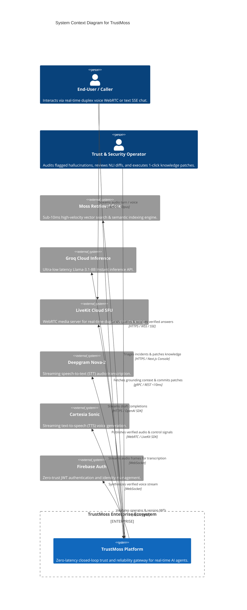
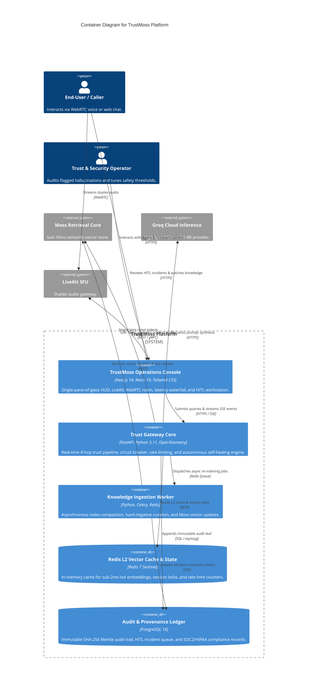
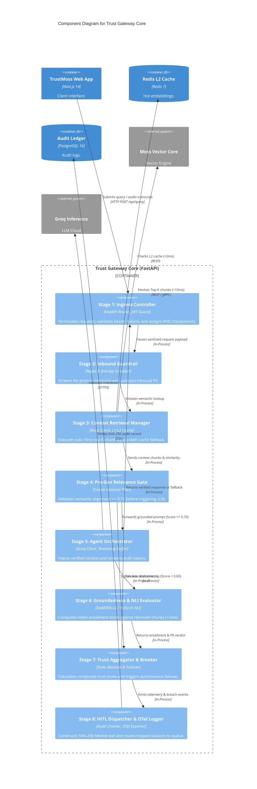

# TrustMoss — C4 Architecture Specification

> **Methodology:** Simon Brown's C4 Model (Context, Container, Component, Code)  
> **Repository:** [https://github.com/bhola-dev58/TrustMoss](https://github.com/bhola-dev58/TrustMoss)  
> **Status:** Approved & Implemented Production Architecture  

---

## 1. Level 1: System Context Diagram

The **System Context** diagram illustrates how TrustMoss fits into the broader enterprise environment, highlighting human personas and external dependencies.

---

## 2. Level 2: Container Diagram

The **Container** diagram decomposes the TrustMoss platform into deployable, independently scalable services, user interfaces, and datastores.

---

## 3. Level 3: Component Diagram (Trust Gateway Core)

Zooming into the **Trust Gateway Core (`api_gateway`)**, this diagram reveals the 8 micro-components executing the synchronous trust loop in under 45ms.

---

## 4. Architectural Decisions & Principles (ADR Summary)

1. **Decoupled Safety Fabric:** The LLM does not evaluate its own safety. Groundedness is verified externally by an isolated NLI component in $<5\text{ms}$.
2. **Zero-Latency Retrieval SLA:** Moss provides sub-10ms retrieval, fronted by a local in-memory L1 cache and Redis L2 sentinel replica to ensure guaranteed $<45\text{ms}$ total turn latency.
3. **Autonomous Self-Healing:** Circuit breakers automatically failover to secondary LLM endpoints in $<12\text{ms}$ if Groq latency spikes, while initiating background Moss compaction.
4. **Immutable Cryptographic Ledger:** Every interaction produces a deterministic SHA-256 hash chaining Query, Chunks, Answer, TrustScore, and Operator Commit for SOC2/HIPAA compliance.
