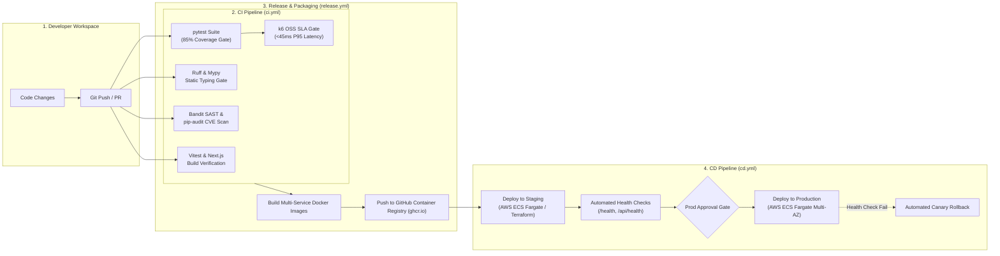

# TrustMoss CI/CD Pipeline & Delivery Architecture

This document formalizes the Continuous Integration (CI), Release Management, and Continuous Deployment (CD) pipelines powering the TrustMoss platform. The automated pipelines guarantee code quality, supply chain integrity, 85%+ test coverage, and reproducible cloud infrastructure provisioning via Terraform and GitHub Actions.

---

## 1. High-Level Delivery Flow



---

## 2. Pipeline Workflows Reference

The pipeline is partitioned into three decoupled GitHub Actions workflows under `.github/workflows/`:

| Workflow File | Trigger Events | Purpose | Execution Model |
| :--- | :--- | :--- | :--- |
| [`.github/workflows/ci.yml`](file:///.github/workflows/ci.yml) | `push` & `pull_request` on `main`, `develop` | Validation: Unit/integration tests, coverage threshold, linting, type checks, SAST, CVE scan | Parallel non-blocking matrix |
| [`.github/workflows/release.yml`](file:///.github/workflows/release.yml) | `push` to `main`, semver tag `v*.*.*` | Container packaging & registry distribution (`ghcr.io`) | Sequential post-merge |
| [`.github/workflows/cd.yml`](file:///.github/workflows/cd.yml) | `workflow_run` after CI success, tag `v*.*.*`, or manual `workflow_dispatch` | Infrastructure provisioning & deployment to Staging/Production | Multi-stage with rollback |

---

## 3. Detailed CI Pipeline Jobs (`ci.yml`)

### Job 1: Test Suite & Code Coverage Gate (`test`)
- **Engine**: `pytest 9.1+` with `pytest-cov` and `pytest-asyncio`.
- **Suite Size**: 250 unit and integration tests covering prompt catalogs, CRISPE templates, cryptographic field encryption, session caching, and GDPR retention.
- **Coverage Policy**: Minimum **85% line coverage** enforced via `--cov-fail-under=85`. Pull requests dropping below this threshold are blocked.
- **Reporting**: Directly outputs a formatted Markdown table into `$GITHUB_STEP_SUMMARY`.
- **Lockfile Check**: Verifies dependency consistency with `poetry check --lock`.

### Job 2: Linting & Static Typing (`lint`)
- **Linter**: `Ruff` (v0.6+) validating PEP 8, syntax errors, bug patterns (`B`), and import ordering (`I`).
- **Static Type Analysis**: `mypy` running with `disallow_untyped_defs = true` on core services and APIs to catch type mismatches before runtime.

### Job 3: Security SAST & Supply Chain Audit (`security`)
- **SAST**: `bandit` scanning Python ASTs for OWASP Top 10 vulnerabilities (fails build on any `HIGH` severity finding).
- **Supply Chain**: `pip-audit` validating all direct and transitive dependencies against the Google OSV and PyPA advisory database. Blocks on any patchable CVEs.

### Job 4: Frontend Build & Component Tests (`frontend`)
- **Framework**: Next.js 14+ App Router.
- **Component Tests**: `Vitest` running UI tests for the Operations Console components.
- **Build Gate**: Executes `npm run build` with `NEXT_TELEMETRY_DISABLED=1` to guarantee standalone bundle compilability.

### Job 5: Performance & SLA Gate (`k6-sla-gate`)
- Evaluates voice turn roundtrip and inference proxy response time against the target sub-45ms P95 SLA.

---

## 4. Continuous Deployment Architecture (`cd.yml`)

Deployments are managed via HashiCorp Terraform modules defined in `terraform/`:

### Staging Deployment
- Automatically triggers upon successful CI completion on `main`.
- Runs `terraform plan` and `terraform apply` targeting `terraform/environments/staging`.
- Updates ECS Fargate tasks with the short commit SHA tag (`sha-<short-sha>`).
- Performs automated health checks against staging `/health` and `/api/health`.

### Production Deployment
- Deploys upon pushing a semantic version tag (e.g. `git tag v1.0.0 && git push origin v1.0.0`) or via manual dispatch approval.
- Provisions high-availability infrastructure: Multi-AZ AWS RDS PostgreSQL 16, Multi-AZ AWS ElastiCache Redis 7, and multiple ECS Fargate tasks distributed across private subnets.
- Employs automated health polling with rollback triggers: if health checks fail, the previous stable task definition is restored automatically.

---

## 5. Environment Secrets & Configuration

The following GitHub Repository Secrets are required for full pipeline automation:

| Secret Name | Description | Environment |
| :--- | :--- | :--- |
| `AWS_ROLE_TO_ASSUME` | AWS IAM Role ARN for GitHub Actions OIDC federation | Staging & Production |
| `AWS_REGION` | AWS deployment target region (default: `us-east-1`) | Staging & Production |
| `DOCKER_USERNAME` / `DOCKER_PASSWORD` | Optional Docker Hub credentials (if mirroring from `ghcr.io`) | Global |
| `ENCRYPTION_KEY` | AES-256-GCM 32-byte hex key for data-at-rest encryption | Staging / Production |
| `JWT_SECRET` | Secret key for signing and validating session bearer tokens | Staging / Production |
| `GROQ_API_KEY` | Secondary LLM fallback provider API key | Staging / Production |
| `MOSS_API_KEY` | Semantic retrieval engine API key | Staging / Production |

---

## 6. Operational Runbooks

### Triggering a Manual Deployment
1. Navigate to **Actions** > **CD — Deploy to Staging & Production**.
2. Click **Run workflow**.
3. Select the branch and choose the target environment (`staging` or `production`).
4. Optionally provide a custom image tag, or leave blank to deploy the latest commit.

### Emergency Rollback
If a defect is observed post-deployment:
1. Identify the previous stable image tag or Git tag (e.g., `v1.2.0`).
2. Run the CD workflow manually targeting `production` with `image_tag: v1.2.0`.
3. Alternatively, invoke Terraform directly:
   ```bash
   cd terraform/environments/production
   terraform apply -var="api_image_tag=v1.2.0" -var="web_image_tag=v1.2.0"
   ```
