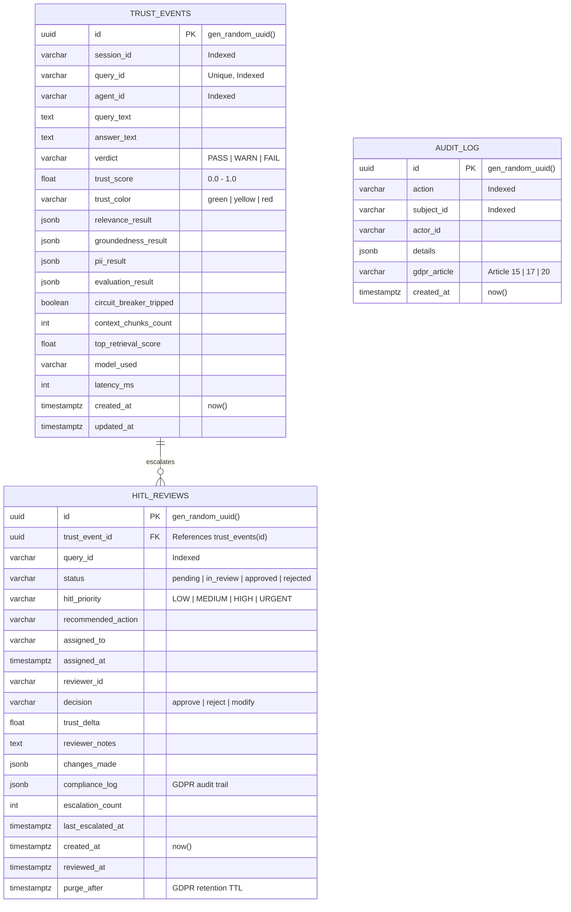
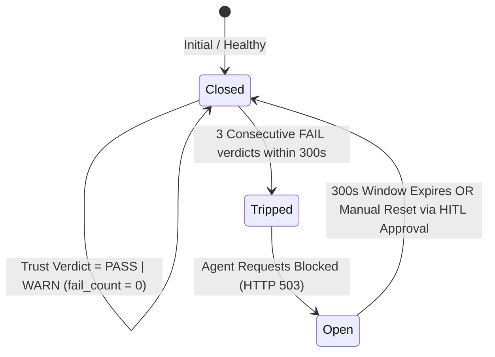

# TrustMoss — PostgreSQL & Redis Persistence Architecture

> **Specification:** Enterprise Persistence & Caching Layer — Phase 9  
> **Primary Store:** PostgreSQL 16 (asyncpg connection pool)  
> **Session Cache & Circuit Breaker:** Redis 7 (redis.asyncio)  
> **Migration Engine:** Alembic (revision tracking, UTC timestamps)  
> **Resilience:** Full zero-crash graceful degradation to in-memory mode  

---

## 1. Overview & Architectural Motivation

TrustMoss acts as the real-time reliability and security gateway intercepting agent interactions. To transition from an ephemeral prototype to an enterprise-grade platform capable of serving millions of agent queries with sub-millisecond session state retrieval and audit-proof compliance records, TrustMoss implements a dual persistence architecture:

1. **PostgreSQL 16 (System of Record)**: High-durability relational storage with PostgreSQL `JSONB` document support for unstructured RAG guardrail evaluation matrices, cryptographic checksums, and immutable GDPR audit logs.
2. **Redis 7 (Low-Latency Cache & State Machine)**: Sub-millisecond distributed cache for active session turn histories, HITL priority queues (sorted sets), and distributed circuit breaker state tracking.
3. **Zero-Crash Graceful Fallback**: Both layers feature immediate, automated fallback to in-memory data structures whenever external services are unreachable. Applications start and pass health checks in isolated, offline, or test environments without hard dependencies.

---

## 2. PostgreSQL Schema Architecture (Alembic Migrations)

Database migrations are managed via **Alembic** (`alembic.ini` and `migrations/versions/0001_initial_schema.py`), connected through the TrustMoss Secret Abstraction Layer (`apps/api/secrets.py`).

### 2.1 Core Relational Tables



### 2.2 Table Specifications

| Table | Purpose | Indexing Strategy | Retention Policy |
| :--- | :--- | :--- | :--- |
| `trust_events` | Telemetry record for every intercepted query/response | `session_id`, `query_id` (UNIQUE), `agent_id`, `created_at` | 30 days (default) |
| `hitl_reviews` | Human-in-the-loop escalation and review decisions | `trust_event_id` (FK CASCADE), `query_id`, `status` | 90 days (default) |
| `audit_log` | Append-only compliance trail (GDPR Art. 15, 17, 20) | `action`, `subject_id`, `created_at` | 30 days (default) |

### 2.3 Running Database Migrations

```bash
# Apply migrations online to latest revision
alembic upgrade head

# Rollback one migration revision
alembic downgrade -1

# Generate SQL script for dry-run offline execution
alembic upgrade head --sql
```

---

## 3. Redis Key Schema & Distributed State

Redis operates in-memory with LRU memory eviction (`allkeys-lru`, max 256MB) to ensure fast reads and deterministic performance without unbounded growth.

### 3.1 Key Topology

| Key Pattern | Redis Type | TTL | Purpose |
| :--- | :--- | :--- | :--- |
| `session:{session_id}:history` | `LIST` | 2 hours (`7200s`) | Stores JSON-encoded QueryResponse objects. Trimmed to 50 items. |
| `session:{session_id}:trust` | `HASH` | 2 hours (`7200s`) | Latest trust score, verdict, and timestamp for the session. |
| `circuit_breaker:{agent_id}` | `HASH` | 5 min window (`300s`) | `{count, tripped, last_fail_at}` tracking consecutive trust failures. |
| `hitl_queue:pending` | `ZSET` | Persistent | Priority queue sorted by urgency score (`URGENT=100`, `HIGH=75`, `MED=50`, `LOW=25`). |
| `hitl_meta:{query_id}` | `HASH` | Persistent | Review metadata associated with enqueued HITL items. |

### 3.2 Circuit Breaker State Machine



1. **Failure Recording**: When an agent query yields a `FAIL` trust verdict, `session_store.record_trust_failure(agent_id)` is invoked.
2. **Threshold Violation**: Upon reaching `CIRCUIT_BREAKER_THRESHOLD` (default: `3`), the circuit is flagged as `tripped=True`.
3. **Gateway Enforcement**: Subsequent `/query` calls for that agent fail-fast with `HTTP 503: Circuit breaker TRIPPED for agent '{agent_id}'`.
4. **Recovery**: Breakers auto-expire after `CIRCUIT_BREAKER_WINDOW_SEC` (300 seconds), or can be immediately cleared via `session_store.reset_circuit(agent_id)` upon Human-in-the-loop review approval.

---

## 4. Lifespan & Microservices Wiring

Both PostgreSQL and Redis are managed via FastAPI lifespan handlers in `apps/api/main.py`:

```python
@asynccontextmanager
async def lifespan(app: FastAPI):
    # Startup
    await moss_client.init()
    await database.startup()   # Initializes asyncpg connection pool + Redis client
    ...
    yield
    # Shutdown
    await database.shutdown()  # Gracefully drains pools and closes sockets
```

### Health Check Endpoint (`GET /health`)

The `/health` endpoint exposes real-time connection status across both databases:

```json
{
  "service": "trustmoss-gateway",
  "status": "healthy",
  "version": "0.2.0",
  "database": {
    "postgresql": "connected",
    "redis": "connected"
  }
}
```

If either service is unavailable, the status gracefully reports `"unavailable (in-memory mode)"`, and operations proceed unhindered.
